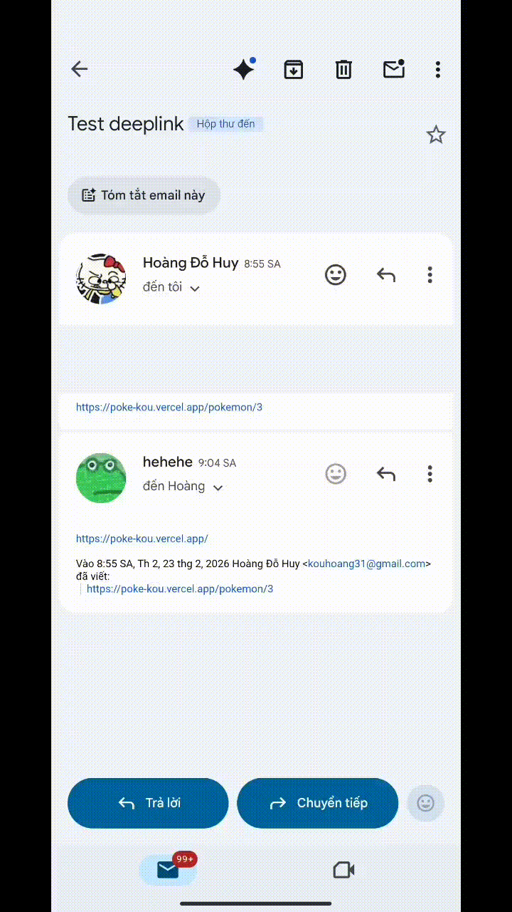

# 🎮 PokéDeeplink

> Flutter app demo **Android App Links** (Deep Linking) — bấm link web tự mở app đúng màn hình.

<div align="center">



[](https://flutter.dev)
[](https://dart.dev)
[](https://poke-kou.vercel.app)
[](https://developer.android.com)

**🌐 Web:** [poke-kou.vercel.app](https://poke-kou.vercel.app) &nbsp;|&nbsp; **📱 Deep link demo:** [poke-kou.vercel.app/pokemon/3](https://poke-kou.vercel.app/pokemon/3)

</div>

---

### Cấu hình Android App Links

**`android/app/src/main/AndroidManifest.xml`**
```xml
<intent-filter android:autoVerify="true">
    <action android:name="android.intent.action.VIEW"/>
    <category android:name="android.intent.category.DEFAULT"/>
    <category android:name="android.intent.category.BROWSABLE"/>
    <data
        android:scheme="https"
        android:host="poke-kou.vercel.app"
        android:pathPrefix="/pokemon"/>
</intent-filter>
```

**`web/.well-known/assetlinks.json`** — được serve tại `https://poke-kou.vercel.app/.well-known/assetlinks.json`
```json
[{
  "relation": ["delegate_permission/common.handle_all_urls"],
  "target": {
    "namespace": "android_app",
    "package_name": "com.example.poke_deeplink",
    "sha256_cert_fingerprints": ["2D99EF132439B377A0DD6987C271D4E8B73603D576FD9BB03407BF996C4B175A"]
  }
}]
```

---

**Tech stack:**
- 🧠 **State management:** flutter_bloc (Cubit)
- 🛣️ **Routing:** go_router
- 🌐 **Networking:** dio + retrofit
- 📦 **DI:** get_it
- 🖼️ **Images:** cached_network_image
- ✨ **Animations:** flutter_animate

---

## 🚀 Chạy project

### Yêu cầu
- Flutter 3.x
- Android Studio / VS Code
- Thiết bị Android (khuyến nghị thật, không dùng emulator cho deep link)

### Các bước

```bash
# Clone repo
git clone https://github.com/YOUR_USERNAME/poke_deeplink.git
cd poke_deeplink

# Cài dependencies
flutter pub get

# Chạy app (debug)
flutter run

# Build release APK
flutter build apk --release
```

### Test Deep Link trên Android

```bash
# Sau khi cài app, test deep link bằng adb
adb shell am start -a android.intent.action.VIEW \
  -d "https://poke-kou.vercel.app/pokemon/25" \
  com.example.poke_deeplink

# Kiểm tra trạng thái xác minh App Links
adb shell pm get-app-links com.example.poke_deeplink
```

---

## 🌐 Deploy Web (Vercel)

Project sử dụng **Vercel** để host Flutter Web — đóng vai trò fallback khi app chưa cài.

```bash
# Vercel tự động build qua vercel.json
# Chỉ cần push code lên GitHub là Vercel tự deploy
git push origin main
```

Xem chi tiết: [DEPLOY_GUIDE.md](DEPLOY_GUIDE.md)

---

## 📝 License

MIT © 2025
